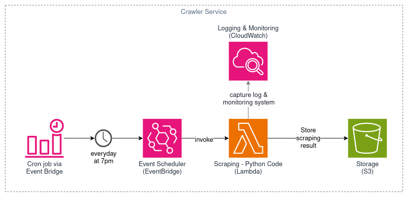

# Data Crawler

> [!Important]
> Docs is under construction 🚧

Crawler service for Exchange Rate App.

## Installation

### Pre-requisite

- [Python](https://www.python.org/downloads/) `v3.7` or latest
- [NodeJS](https://nodejs.org/en/download/) v18 or latest (optional, for deployment)
- Active [AWS Account](https://aws.amazon.com/) (optional, for deployment)

    > [!NOTE]
    > AWS used for storing scraping result to [AWS S3](https://aws.amazon.com/s3/) and for deployment. See [deployment](#deployment) section for more information.

### Setup

1. Clone [this project](https://github.com/muhammadfajri-tif/exchange-rate-crawler).

    For example to clone using git with https:

    ```
    git clone https://github.com/muhammadfajri-tif/exchange-rate-crawler.git
    ```

2. Install required packages/dependencies

    > [!TIP]
    > Use virtual environments like venv to separate packages/dependencies that required for this project. To create virtual environments please refer to [this docs](https://docs.python.org/3/library/venv.html#creating-virtual-environments).


    ```bash
    pip install -r requirements.txt
    ```

3. Configure environments variable (`.env`)

    Copy the template from `.env.example`

    ```bash
    cp .env.example .env
    ```

    Edit the `.env` file by filling in the environment variables values. Each variable has its own purpose. Here's the available and required variables:

    | variable name | mandatory | description | 
    | --- | --- | --- |
    | `APP_NAME` | required | Stage name for the project. For example `local`, `dev` or `prod`. |
    | `BUCKET_NAME` | optional (used in production) | Name of AWS S3 bucket. Used for storing scraping data on the Cloud storage. Make sure the S3 bucket is already exist. |
    | `AWS_ACCESS_KEY` | required if `BUCKET_NAME` is set otherwise it's optional | Access key for grants programmatic access to AWS resources. Used to authenticate when uploading scraping data to S3. For information about AWS credentials, please refer to the [official docs](https://docs.aws.amazon.com/IAM/latest/UserGuide/id_credentials_access-keys.html#access-keys_required-permissions). |
    | `AWS_SECRET_ACCESS_KEY` | required if `BUCKET_NAME` is set otherwise it's optional | Secret access key is used in pairs with the access key for grants programmatic access to AWS resources. |
    | `AWS_REGION_NAME` | required if `BUCKET_NAME` is set otherwise it's optional | Used for set AWS Region that stores the S3 bucket. For example `us-east-1`, `ap-southeast-1`, etc. For information about AWS Regions, please refer to the [official docs](https://docs.aws.amazon.com/AmazonRDS/latest/UserGuide/Concepts.RegionsAndAvailabilityZones.html#Concepts.RegionsAndAvailabilityZones.Regions). |


---

## Deployment

### Run locally

- **Storing data on Cloud Storage (AWS S3)**

    >[!IMPORTANT]
    > You must have an AWS account and set the `.env` file properly. Create credential for programmatic access to AWS S3. This can be achieve by creating IAM role or user with `AmazonS3FullAccess` policy attached. [Learn more](https://docs.aws.amazon.com/cli/latest/userguide/cli-authentication-user.html).

    To run crawler simply run following command:

    ```bash
    scrapy crawl exchange_rate
    ```

- **Storing data locally**
    
    If you want to export the data as json:

    ```bash
    scrapy crawl exchange_rate -O scraping-data.json
    ```

    or if you want to export the data as csv, simply just run the following command:

    ```bash
    scrapy crawl exchange_rate -O scraping-data.csv
    ```

    > [!TIP]
    > You can change the file name by changing `scraping-data` to the file name you want. You can also specify path location to save the file by using relative path. <br/>
    > For example, if you want to save the scraping results in json format and the file name is `data` in the `export` folder. Simply replace `scraping-data.json` from command above to `export/data.json`

### Run on AWS

>[!IMPORTANT]
> You must have an AWS account and set the `.env` file properly. AWS credentials are required to deploy the code. Read each section carefully.

#### Overview

The crawler service is hosted on AWS, allowing it to run automatically in the cloud. The crawler service is deployed with a serverless services and runs on [AWS Lambda](https://aws.amazon.com/lambda/) powered by [Serverless Framework](https://www.serverless.com/). Take a look the following diagram below:



How does it work:

1. [Serverless Framework](https://www.serverless.com/) provides configuration and provisioning required infrastructures such as AWS Lambda, AWS EventBridge, and AWS CloudWatch Logs.

2. All crawler service code deployed in AWS Lambda. The entry point is [`lambda_fn.py`](./lambda_fn.py) at the root of the project, which contains the code to run the crawler service. 

3. [AWS EventBridge](https://aws.amazon.com/eventbridge/) will create a cronjob to invoke and run Lambda Function automatically according to the specified schedule.

4. Scraping result will be saved in AWS S3 in JSON and CSV format.

5. [AWS CloudWatch](https://aws.amazon.com/cloudwatch/) are used for storing logs from AWS Lambda and monitoring the Function.

#### Configuration

There are several configuration that can be customized:

- Code configuration can be found in the [`src/settings.py`](./src/settings.py). This includes configuration of scraping, request throttling, logging, targets location for scraping results

- infrastructure configuration can be found in the [`serverless.yml`](./serverless.yml). This file includes configuration of Lambda Function, cron expressions, and everything that related to the infrastructures. Learn more about `serverless.yml` configuration reference [here](https://www.serverless.com/framework/docs/providers/aws/guide/serverless.yml).


#### Publish

1. [Setting up Serverless Framework](https://www.serverless.com/framework/docs/getting-started/)

2. [Create and configure AWS credentials](https://www.serverless.com/framework/docs/providers/aws/guide/credentials)

3. Deploy to AWS using following command:
    
    ```bash
    sls deploy --stage prod
    ```

    >[!NOTE]
    > The argument `--stage prod` tells serverless framework to deploy the project with production stage.

---

## Troubleshooting

coming soon...
